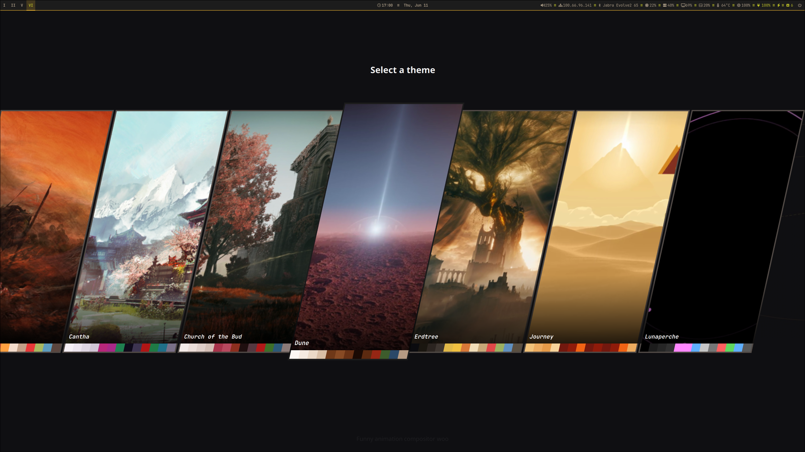

# Rainbeau

Rainbeau is a Hyprland theme engine. It reads a theme JSON file and generates
matching configuration for Hyprland, Waybar, Kitty, GTK, Dunst, Firefox, Neovim,
VS Code, Wofi, and related helper scripts.



It also prepares animated wallpapers by converting Lottie files and GLSL
fragment shaders to cached MP4 files for `mpvpaper`.

## Install

### AUR

```sh
paru -S rainbeau
```

### From source

```sh
go build -o rainbeau .
sudo install -Dm755 rainbeau /usr/bin/rainbeau
```

## Usage

Rainbeau is driven through the `select` subcommand.

Apply a specific theme directly:

```sh
rainbeau select /path/to/theme.json
```

Open the visual theme picker (a quickshell overlay) and choose a theme
interactively:

```sh
rainbeau select
```

The picker appears instantly on the focused monitor as a horizontal carousel of
tilted theme tiles. Navigate with the arrow keys, apply the highlighted theme
with `Enter`, and dismiss without applying with `Escape` or `Q` (or by clicking
outside the tiles).

Each tile is built from the theme's own palette and assets:

- The theme name is drawn in that theme's configured font.
- The card border uses the currently applied theme's colors, so the highlighted
  tile is easy to spot.
- A preview image fills the card with a thin palette strip kept visible along
  the bottom edge. The picker shows a generated palette placeholder immediately,
  then fills in the real preview in the background. Preview images are sourced,
  in order, from the theme's optional `thumbnail`, its first wallpaper image,
  its first wallpaper video, or a previously rendered Lottie/shader wallpaper
  found in the cache.

By default the picker lists theme files found in:

```text
~/.config/rainbeau/themes/*.json
```

Point it at a different directory with `--themes-dir`:

```sh
rainbeau select --themes-dir /path/to/themes
```

Write generated files somewhere other than your home directory:

```sh
rainbeau select /path/to/theme.json --output-dir /tmp/rainbeau-output
```

By default, Rainbeau writes under `$HOME`, so generated files land in paths
like:

```text
~/.config/hypr/theme.conf
~/.config/waybar/config.jsonc
~/.config/kitty/kitty.conf
~/.config/nvim/lua/plugins/colorscheme.lua
```

After generation, Rainbeau reloads Hyprland, restarts the wallpaper cycler,
reloads Waybar/Dunst/Hyprpaper where possible, updates GTK settings, and
remote-reloads Kitty and Neovim instances.

## Theme files

Rainbeau expects a JSON file with sections for colors, Hyprland, fonts, GTK,
Waybar, wallpapers, terminal tuning, and optional Neovim settings. A fully
annotated example with every supported field lives at
[`examples/theme.template.json`](examples/theme.template.json).

An optional top-level `thumbnail` field points at an image used as the theme's
preview tile in the visual picker; it is resolved relative to the theme file and
glob patterns are supported.

Wallpaper entries are resolved relative to the directory containing the theme
file. Glob patterns are supported for image, video, and Lottie lists.

## Runtime integrations

Rainbeau can use these tools when available:

- `quickshell` for the `rainbeau select` visual theme picker
- `hyprctl`, `hyprpaper`, `mpvpaper` for wallpaper and Hyprland reloads
- `waybar`, `dunst`, `kitty`, `nvim` for live reloads
- `ffmpeg` and `rlottie` for Lottie wallpaper and picker thumbnail rendering
- `glslViewer` for GLSL shader wallpaper rendering
- `notify-send` for desktop notifications
- optional target apps for generated configs: Firefox, Neovim, VS Code, Wofi,
  HyprChat, Hyprtoolkit, Omni Launcher, and Quick Visor

Generated Lottie and shader MP4 files are cached under:

```text
~/.cache/shell-dev/lottie-cache
~/.cache/shell-dev/glsl-cache
```
